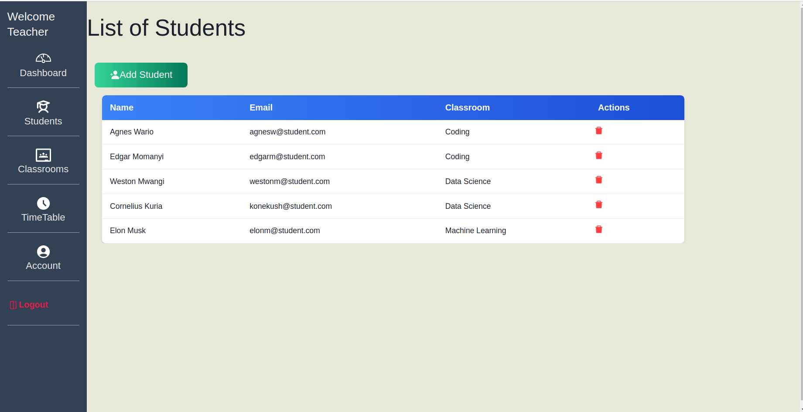
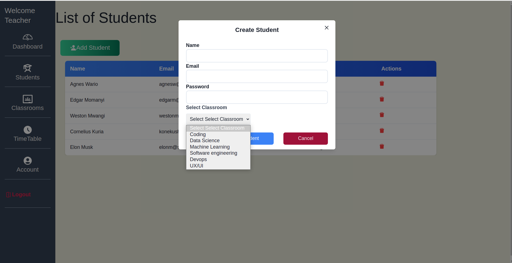
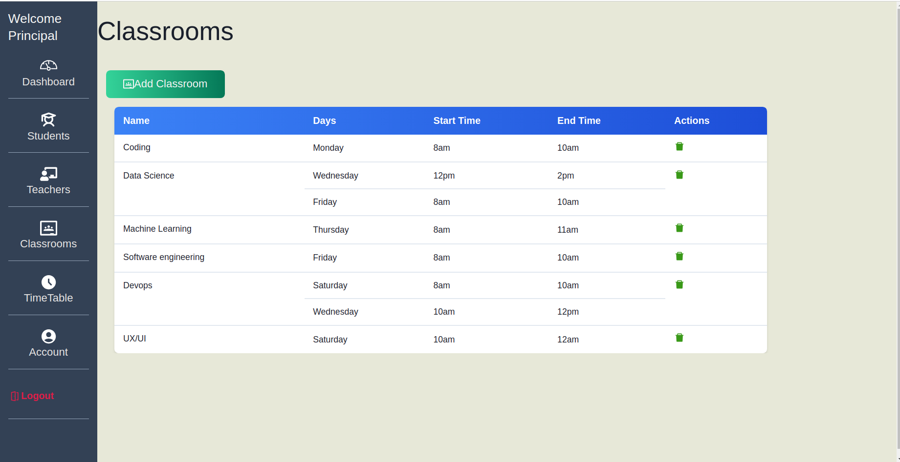
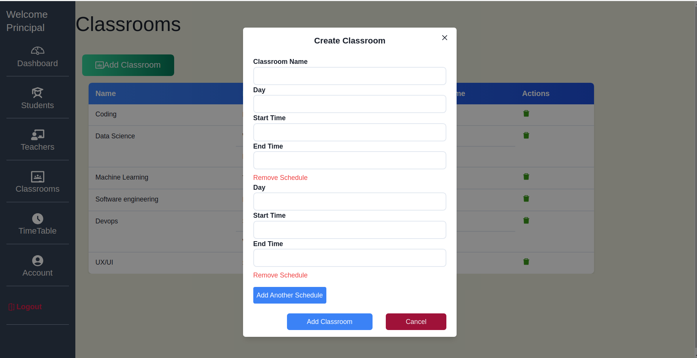

# THE CLASSROOM
### THE PROJECT HAS THREE USERS (TEACHER, STUDENT, PRINCIPAL)
## INSTRUCTIONS

 Run <strong>npm run dev</strong> to start the project

## TECHNOLOGIES USED

<ul>
<li>Vite
<li>React
<li>Redux
<li>Chakra Ui

## ACCESS

To access login using <strong>principal@classroom.com</strong> password is <strong>Admin</strong

## THE UI

